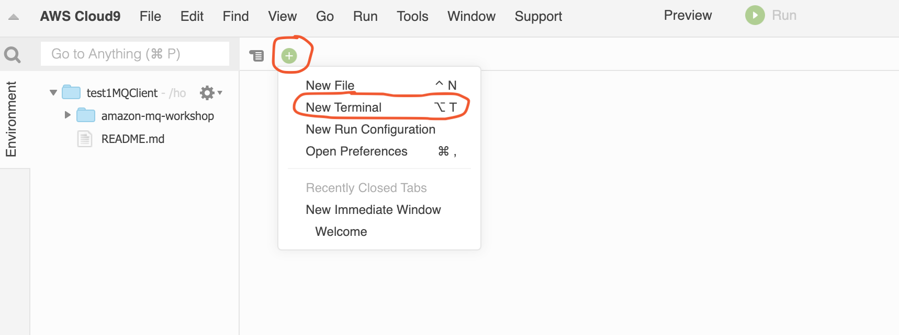

## 2. Data Preparation

For this lab we'll be examining what you can do to prepare your [TSV (tab-separated values)](https://en.wikipedia.org/wiki/Tab-separated_values) raw data, uploaded to Amazon S3.

We're doing this to prepare this dataset to a more analytical friendly format for future exploration and efficient usage, 
still utilizing S3 as your conveniently priced storage.

Once we've done that, we'll then load this data into our Amazon Redshift cluster.


### Now let's configure our terminal

#### If you have access to cloud shell
Go the console search bar and type CloudShell.


1. Once open close the welcome screen

#### Access terminal through Cloud9
AWS Cloud9 is a cloud-based integrated development environment (IDE) that lets you write, run, 
and debug your code with just a browser. It includes a code editor, debugger, and terminal.

1. Your CloudFormation template should have created all the resources you need by now, navigate to [Cloud9 service](https://console.aws.amazon.com/cloud9) and look for RedshiftLakeHouseWS client and click on OpenIDE to open the workspace.
    
1. In the main pane, close the Welcome screen. Open only one terminal. See the picture below for reference:
   
   
   
1. If not already open, open a new Terminal window
   
   
   
1. Run the following commands in the terminal you just opened.
   
    ```shell
    sudo yum install -y postgresql96.x86_64
    ```
   This will do the following, install PSQL a Postgres client to use for doing the cluster labs

### First, Examine the Dataset

The data set is [Amazon Customer Reviews Dataset](https://amazon-reviews-pds.s3.amazonaws.com/readme.html).

1. First we'll list the bucket objects from the AWS console [through this link](https://s3.console.aws.amazon.com/s3/buckets/amazon-reviews-pds?region=us-east-1&tab=objects#)
1. Then we'll examine the dataset size using the AWS CLI. To do this we can utilize the AWS CLI in the terminal described above.
1. We'll now examine the data set size by invoking the s3 cli list command
    ```shell
    aws s3 ls --summarize --human-readable --recursive s3://amazon-reviews-pds/tsv/
    ```
   Notice at the end of the output the data set size in the output as
   ```shell
   Total Objects: 55
   Total Size: 32.2 GiB
   ```
1. You can also do the same for the prepared parquet data set by applying the same command for the path 
   `s3://amazon-reviews-pds/parquet/`.
   Note that this is not the exact dataset as Parquet offers compression advantages when storing data.


### Then, Prepare the Dataset

Our objective now is to prepare the TSV data set and transform it to an analytical format like the prepared one in parquet.
For data preparation you can choose to do this in multiple ways. 
Please branch and use the lab that you'd prefer (you can always go back and check the other way ;) ).


Note: If you wish to continue loading the pre-prepared parquet data set you can directly advance to 
[loading data in your cluster](#finally,-Load-data-in-your-cluster).


* Lab 2a - using **AWS Glue DataBrew** for a visual experience.
  
  AWS Glue DataBrew is a new visual data preparation tool that makes it easy for data analysts and data scientists to clean and normalize data to prepare it for analytics and machine learning.

  You can follow lab [instructions here](./aws-glue-databrew/README.md)
* Or, Lab 2b - using **AWS Glue Studio** for a more hand's experience.
  
  AWS Glue Studio is a new graphical interface that makes it easy to create, run, and monitor extract, transform, and load (ETL) jobs in AWS Glue. You can visually compose data transformation workflows and seamlessly run them on AWS Glue’s Apache Spark-based serverless ETL engine.

  You can follow lab [instructions here](./aws-glue-studio/README.md)

After you finish these labs, we'll continue with data loading. 
While you can use the data that you prepared in previous labs, you can also use data prepared in parquet to do exactly the same.
The labs instructions assume the latter option, so we don't wait for the result of the transformation processes.

### Now, let's Load data in your cluster

Data preparation jobs can take several minutes. 
We can directly advance with the pre-prepared data at `s3://amazon-reviews-pds/parquet/`.

In the next lab we'll copy data physically from our S3 Storage and load it in our Redshift cluster.
[Latter](../lab3-lake-house/README.md) we'll see how we can extend this data by directly querying data in S3 
without the need to load it in our Redshift cluster.

#### Before you begin

Capture the following parameters from [the launched CloudFormation template](https://console.aws.amazon.com/cloudformation/home?region=us-east-1#/stacks?filteringText=&filteringStatus=active&viewNested=true&hideStacks=false) as you will use them in the lab.

* RedshiftClusterRoleArn
* PSQLConnection if you'll use **Cloud9**
* RedshiftClusterPassword if you'll use **Cloud9**

##### Client Tool

The screenshots for this lab will leverage the SQL Client Tool of SQLWorkbench/J.
You can also use Redshift console built-in Query Editor:

* [Redshift Query Editor](https://console.aws.amazon.com/redshiftv2/home?region=us-east-1#query-editor:)
  
**Note:** Redshift query editor currently only runs one SQL statement at a time. 
So, either highlight the statement you’d like to execute, or maintain only a single statement in each tab at a time.

If you're running this workshop in an event that would not allow the query editor. You can use Cloud9 environment.

1. Go to your terminal in the Cloud9 environment, paste put the value of `PSQLConnection` output parameter to initialize a connection.
1. The CLI will then ask you for the user password, please put the value of `RedshiftClusterPassword`

#### Challenge

The data analyst Miguel wants to build product review reports for his business users. They use the reports to evaluate the product reviews, star ratings etc., which helps them plan new product offerings. He asks for Marie’s help to see if there is a way to make the reports perform faster and save costs.

To solve this challenge, Marie decides to load the product review data into the Redshift data warehouse. She will build a data pipeline to source the data and perform an ETL (extract, transform, and load) operation to populate it into a dimensional model. Further, she will setup the data pipeline to make the refresh process repeatable.

Marie will do the following:

* Create and Load the Staging Environment 
* Create the Reporting Model
* Create Materialized Views
* Create Stored Procedures

Here is the architecture of this setup:


##### Create and Load the Staging Environment

Defines a staging table `product_reviews_staging` to load the new product review data. 
This staging table will mimic the structure of the raw source data. 
Using your SQL Client Tool, execute the following command:

```sql
CREATE TABLE public.product_reviews_staging
(
  marketplace         VARCHAR(2),
  customer_id         VARCHAR(32),
  review_id           VARCHAR(24),
  product_id          VARCHAR(24),
  product_parent      VARCHAR(32),
  product_title       VARCHAR(512),
  star_rating         INT,
  helpful_votes       INT,
  total_votes         INT,
  vine                CHAR(1),
  verified_purchase   CHAR(1),
  review_headline     VARCHAR(256),
  review_body         VARCHAR(MAX),
  review_date         DATE,
  YEAR                INT
)
DISTSTYLE KEY DISTKEY (customer_id) SORTKEY (marketplace,review_date);
```

To load the data from S3 to the Redshift staging tables, Marie will use the COPY command. The COPY command is the fastest way to ingest bulk data to Amazon Redshift because it can load multiple data files in parallel.

**Note:** Replace the value for <RedshiftClusterRoleArn> with the value previously determined.

Using your SQL Client Tool, execute the following command. 
This will load Apparel **(5906460 rows)** and Automotive **(3516476)** data.

```sql
COPY public.product_reviews_staging
FROM 's3://amazon-reviews-pds/parquet/product_category=Apparel/'
iam_role '<RedshiftClusterRoleArn>' PARQUET;
```

```sql
COPY public.product_reviews_staging
FROM 's3://amazon-reviews-pds/parquet/product_category=Automotive/'
iam_role '<RedshiftClusterRoleArn>' PARQUET;
```

To double check that the data was loaded correctly, query the staging table to do a sanity check on the number of rows loaded. 
Using your SQL Client Tool, execute the following command. you should expect it to return **9422936** total records.

```sql
SELECT COUNT(*)
FROM public.product_reviews_staging;
```


##### Create the Reporting Model


Based on the reporting requirements from Miguel, Marie needs to create a dimensional model that will be used by the business users. 

She'll first create a date dimension table.

```sql
DROP TABLE IF EXISTS  public.date_dim;
CREATE TABLE IF NOT EXISTS public.date_dim
(
    d_date_sk INTEGER NOT NULL  ENCODE RAW
    ,d_date_id CHAR(16) NOT NULL  ENCODE RAW
    ,d_date DATE   ENCODE RAW
    ,d_month_seq INTEGER   ENCODE RAW
    ,d_week_seq INTEGER   ENCODE RAW
    ,d_quarter_seq INTEGER   ENCODE RAW
    ,d_year INTEGER   ENCODE RAW
    ,d_dow INTEGER   ENCODE RAW
    ,d_moy INTEGER   ENCODE RAW
    ,d_dom INTEGER   ENCODE RAW
    ,d_qoy INTEGER   ENCODE RAW
    ,d_fy_year INTEGER   ENCODE RAW
    ,d_fy_quarter_seq INTEGER   ENCODE RAW
    ,d_fy_week_seq INTEGER   ENCODE RAW
    ,d_day_name CHAR(9)   ENCODE RAW
    ,d_quarter_name CHAR(6)   ENCODE RAW
    ,d_holiday CHAR(1)   ENCODE RAW
    ,d_weekend CHAR(1)   ENCODE RAW
    ,d_following_holiday CHAR(1)   ENCODE RAW
    ,d_first_dom INTEGER   ENCODE RAW
    ,d_last_dom INTEGER   ENCODE RAW
    ,d_same_day_ly INTEGER   ENCODE RAW
    ,d_same_day_lq INTEGER   ENCODE RAW
    ,d_current_day CHAR(1)   ENCODE RAW
    ,d_current_week CHAR(1)   ENCODE RAW
    ,d_current_month CHAR(1)   ENCODE RAW
    ,d_current_quarter CHAR(1)   ENCODE RAW
    ,d_current_year CHAR(1)   ENCODE RAW
    ,PRIMARY KEY (d_date_sk)
    )
    DISTSTYLE ALL
    SORTKEY (
    d_date
    )
;

copy public.date_dim from 's3://salamander-us-east-1/reinvent2018/ant353/tpds/date_dim/manifest'
    IAM_ROLE '<RedshiftClusterRoleArn>' 
    DELIMITER '~' gzip manifest IGNOREHEADER 1 region 'us-east-1';
```

She will then create a FACT table in Redshift called `daily_product_reviews_fact` 
along with a dimensional table called `product_dim`, and leverage the just created `date_dim` table.

Here is the dimensional model for the setup:


Using your SQL Client Tool, execute the following command:

```sql
CREATE TABLE public.daily_product_reviews_fact
(
  marketplace           VARCHAR(2),
  product_id            VARCHAR(24),
  count_rating          INT,
  sum_rating            INT,
  total_helpful_votes   INT,
  total_votes           INT,
  review_date           DATE
)
DISTSTYLE EVEN SORTKEY (review_date);
```

```sql
CREATE TABLE public.product_dim
(
  product_id       VARCHAR(24),
  product_parent   VARCHAR(32),
  product_title    VARCHAR(512),
  effective_date   DATE,
  current_flag     CHAR(1)
)
DISTSTYLE ALL SORTKEY (product_id);
```

DATE_DIM table is pre-loaded, run below query to verify it has data (row count = **73049**)

```sql
SELECT COUNT(*)
FROM public.date_dim;
```

##### Create Materialized Views

To further speedup reporting, Marie will leverage materialized views to precompute the result set for transformations. That will be reused in the different steps of the dimensional model refresh. In addition, Materialized views will provide a performance improvement for aggregation operations.

The first view will implement the business rule for daily fact table aggregation. Using your SQL Client Tool, execute the following command:

```sql
CREATE MATERIALIZED VIEW public.daily_product_review_fact_staging_mv
AS
SELECT marketplace,
       product_id,
       COUNT(1) as count_rating,
       SUM(star_rating) as sum_rating,       
       SUM(helpful_votes) AS total_helpful_votes,
       SUM(total_votes) AS total_votes,
       review_date
FROM public.product_reviews_staging
GROUP BY marketplace,
         product_id,
         review_date;
```

The next set of views will implement the business rule to:

1. Get the latest product dimension attributes. 
1. Get product dimension attributes that have been changed and need to be updated.
1. Get new products that need to be inserted.

Using your SQL Client Tool, execute the following command:

```sql
CREATE MATERIALIZED VIEW public.product_dim_staging_mv
AS
SELECT product_id,
       product_parent,
       product_title,
       review_date,
       CHECKSUM(CAST(product_parent || product_title AS VARCHAR(550)))
FROM (SELECT product_id,
             product_parent,
             product_title,
             review_date,
             ROW_NUMBER() OVER (PARTITION BY product_id ORDER BY review_date DESC,product_parent,product_title) AS rn
      FROM public.product_reviews_staging)
WHERE rn = 1;
```

```sql
CREATE VIEW public.product_dim_scd2_update_vw
AS
SELECT s.*
FROM public.product_dim p
  INNER JOIN public.product_dim_staging_mv s
          ON p.product_id = s.product_id
         AND CHECKSUM (CAST (p.product_parent || p.product_title AS VARCHAR (550))) <> s.checksum;
```

```sql
CREATE VIEW public.product_dim_scd2_new_vw
AS
SELECT s.*
FROM public.product_dim p
  RIGHT OUTER JOIN public.product_dim_staging_mv s ON p.product_id = s.product_id
WHERE p.product_id IS NULL;
```

##### Create Stored Procedures

Marie will use stored procedures to execute the transformations for the ETL process. Stored Procedure provide a convenient method to encapsulate the business logic. The first procedure will update the PRODUCT_DIM table by doing the following steps:

1. Update existing records which are flagged as update setting current_flag = 0.
1. Insert records which are flagged as update with their new attributes and current_flag = 1.
1. Insert records which are flagged as new products

Using your SQL Client Tool, execute the following command:

```sql
CREATE OR REPLACE PROCEDURE public.sp_merge_product_dim (loaddate DATE)
AS
$$ BEGIN IF loaddate IS NULL THEN RAISE EXCEPTION 'input cannot be null';
END IF;

REFRESH MATERIALIZED VIEW public.product_dim_staging_mv;

-- Update existing product_id current_flag to 0 and set effective_date to current_date
UPDATE public.product_dim
   SET current_flag = 0
FROM public.product_dim p
  INNER JOIN public.product_dim_scd2_update_vw s ON p.product_id = s.product_id
WHERE p.current_flag = 1;

INSERT INTO public.product_dim
SELECT product_id,
       product_parent,
       product_title,
       CURRENT_DATE,
       1
FROM public.product_dim_scd2_update_vw
WHERE review_date >= loaddate
UNION
-- New products
SELECT product_id,
       product_parent,
       product_title,
       CURRENT_DATE,
       1
FROM public.product_dim_scd2_new_vw
WHERE review_date >= loaddate;

END;
$$ LANGUAGE plpgsql;
```

The second procedure will insert new aggregated data into the daily_product_reviews_fact table. Using your SQL Client Tool, execute the following command:

```sql
CREATE OR REPLACE PROCEDURE public.sp_merge_daily_product_reviews_fact (loaddate DATE)
AS
$$ BEGIN IF loaddate IS NULL THEN RAISE EXCEPTION 'input cannot be null';
END IF;

REFRESH MATERIALIZED VIEW public.daily_product_review_fact_staging_mv;

INSERT INTO public.daily_product_reviews_fact
SELECT s.marketplace,
       s.product_id,
       s.count_rating,
       s.sum_rating,       
       s.total_helpful_votes,
       s.total_votes,
       s.review_date
FROM public.daily_product_review_fact_staging_mv s
  LEFT OUTER JOIN public.daily_product_reviews_fact f
               ON s.product_id = f.product_id
              AND s.review_date = f.review_date
WHERE f.product_id IS NULL
AND   s.review_date >= loaddate;

END;
$$ LANGUAGE plpgsql;
```


To test this pipeline, let’s execute the stored procedures and expect the data in the dimensional model to be refreshed. Pass in the parameter `1900-01-01` to trigger the load of the historical data.
Using your SQL Client Tool, execute the following command:

```sql
call public.sp_merge_product_dim ('1900-01-01'::DATE);
```

To trigger an incremental load, she can pass in the date of the last load.

```sql
call public.sp_merge_daily_product_reviews_fact ('1900-01-01'::DATE);
```

To do a quick sanity check on the data, execute the following count queries.

You should expect **3,068,610** records in the `product_dim` table and **9,084,801** records in the `daily_product_reviews_fact table`.

```sql
SELECT COUNT(*)
FROM public.product_dim;
```

```sql
SELECT COUNT(*)
FROM public.daily_product_reviews_fact;
```

### Streaming pipeline

#### Before you begin

Capture the following parameters from [the launched CloudFormation template](https://console.aws.amazon.com/cloudformation/home?region=us-east-1#/stacks?filteringText=&filteringStatus=active&viewNested=true&hideStacks=false) as you will use them in the lab.

* RedshiftClusterRoleArn
* GlueExternalDatabaseName

#### Challenge

The data analyst Miguel needs to get the latest product reviews in as soon as possible, so he can build a dashboard to show the latest product trend and customer purchase habits. He asks Marie to build an ingestion pipeline to load the latest data into the Redshift data warehouse in near real-time.

The architecture of the new pipeline will look like the following:


To solve this challenge Marie will do the following:

* Create the streaming pipeline 
* Query the data

#### Create the streaming pipeline

Marie will use Amazon Kinesis Firehose to stream new product reviews data into Redshift. First, Marie must create a table in Redshift where the streaming data will land.
Using your SQL editor, execute the following statement.

```sql
CREATE TABLE public.product_reviews(
  marketplace varchar(2),
  customer_id varchar(32),
  review_id varchar(24),
  product_id varchar(24),
  product_parent varchar(32),
  product_title varchar(512),
  star_rating int,
  helpful_votes int,
  total_votes int,
  vine char(1),
  verified_purchase char(1),
  review_headline varchar(256),
  review_body varchar(max),
  review_date date,
  year int,
  product_category varchar(32),
  insert_ts datetime default current_timestamp)
DISTSTYLE KEY
DISTKEY (customer_id)
SORTKEY (
    marketplace,
    product_category,
    review_date);
```

In this lab, a Firehose Delivery Stream is pre-setup to receive the incoming data and populate that data into the Redshift table created above. 
Navigate to the firehose console and find a delivery stream name like [product_reviews-#####](https://console.aws.amazon.com/firehose/home?region=us-east-1#/dashboard/list) and example its configuration.


Let’s also see how the Redshift Cluster connection was configured. Scroll to the “Amazon Redshift destination” section. Note the JSON ‘auto’ clause which tells the copy operation how to parse the JSON file containing the product reviews. Also, note the Redshift connection configuration.


A Glue python shell job is setup to push data to Kinesis firehose. Navigate to the [Glue Job](https://console.aws.amazon.com/glue/home?region=us-east-1#etl:tab=jobs), 
select the `product_review_generator-#####` one, Click on the `Run Job button` to start generating data. 
The job will run and generate data for 10 minutes. Watch below gif animation to see the detailed steps.


Let’s check if the firehose delivery stream gets data. 
Navigate to [Firehose](https://console.aws.amazon.com/firehose/home?region=us-east-1#/dashboard/list), 
select the firehose delivery stream and monitor the data being sent to S3 then copied to Redshift.


#### Query the data

Marie wants to now validate the data is loaded into Redshift every minute.

Using your SQL editor, execute the following statement. Note that the data is continually loading including the most recent minute.

```sql
select
  date_trunc('minute', insert_ts) insert_min,
  sum(total_votes) votes
from public.product_reviews
group by 1
order by 1 desc
```

### Next step
Continue to [query data in your data lake](../lab3-lake-house/README.md).