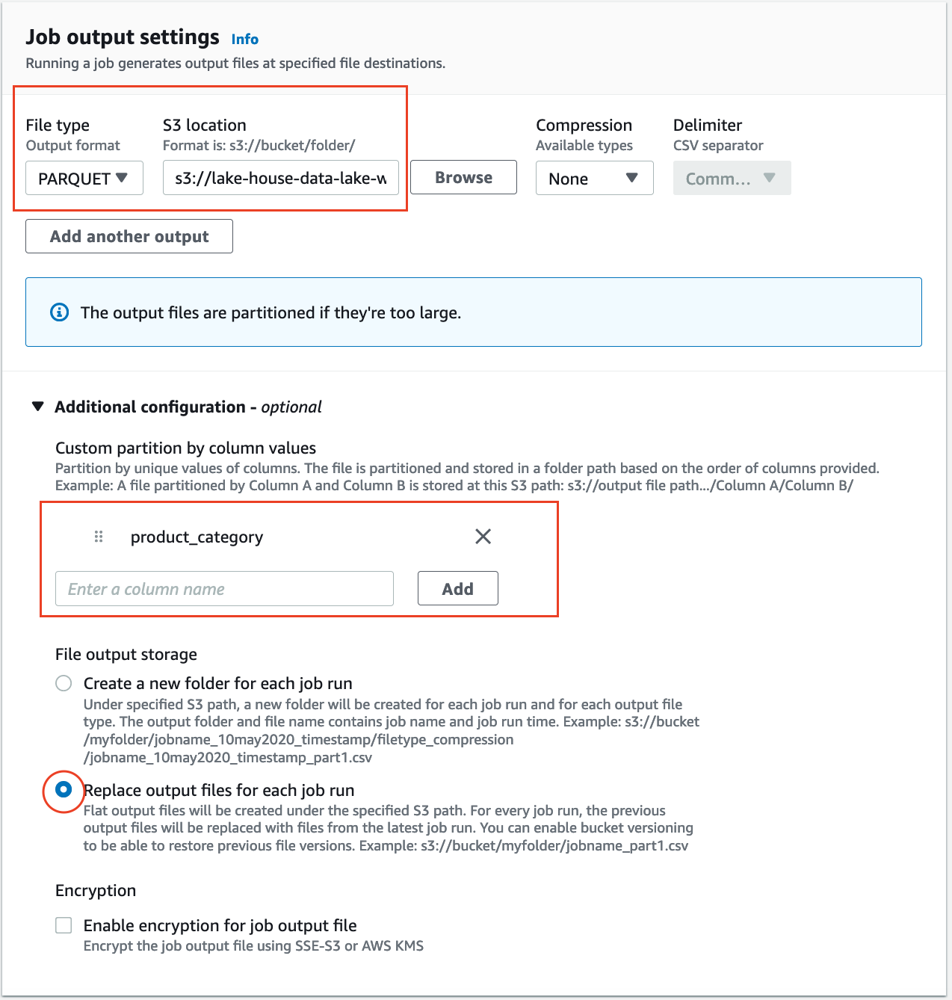

## Data Preparation

AWS Glue DataBrew is a visual data preparation tool that makes it easy for data analysts, data scientists and non-technical users to prepare data with an interactive, point-and-click visual interface without writing code. With Glue DataBrew, you can easily visualize, clean, and normalize terabytes, and even petabytes of data directly from your data lake, data warehouses, and databases. You can create a dataset using any of these data sources; Amazon S3, AWS Glue Data Catalog (Amazon Redshift, Amazon Aurora, and Amazon RDS) and [AWS Data Exchange](https://aws.amazon.com/data-exchange/). For more information on Data Sources supported on DataBrew, see [Creating and using AWS Glue DataBrew datasets](https://docs.aws.amazon.com/databrew/latest/dg/datasets.html).

In this lab, we will use DataBrew to explore, and prepare the data for analytics.

This lab is optional. You can run it, or you can run [data preparation with AWS Glue Studio](../aws-glue-studio/README.md).

### Architectural Diagram

This is an example architecture, the raw data is stored in Amazon S3 in CSV format. We will use DataBrew to read and prepare the data and write the results to a destination bucket.

### Setting up DataBrew

In this section we will setup an AWS Glue DataBrew project which is an interactive data preparation workspace in DataBrew. During this process we will create the following:

* **Dataset:** data that’s stored elsewhere and details on how DataBrew can connect to that data. 
* **Recipe:** a set of instructions or steps for data that you want DataBrew to act on. A recipe can contain many steps, and each step can contain many actions. We will create the recipe without adding any steps, as we will add the steps in the next section.

Creating a DataBrew project

1. On the [DataBrew console](https://console.aws.amazon.com/databrew/home), choose **Projects** from the left sidebar. 
   
1. Choose **Create project**. 
   
1. For “Name”, enter `amazon-reviews-project`.

1. For “Attached recipe”, choose Create new recipe. 
   
1. For “Recipe name”, the value `amazon-reviews-project-recipe` should be populated.
   
   
   
1. Scroll down and for “Select a dataset”, choose New dataset. 

1. For “Dataset name"¸ enter `amazon-reviews`.
   
   
   
1. For **Connect to new dataset**, you have the option to either upload files, connect to S3, Glue Data Catalog or Data Exchange. 
   For this lab, choose Amazon S3, then S3 path and choose the path to your dataset in S3. 
   We'll use an existing data for amazon products reviews in the following S3 prefix; **s3://amazon-reviews-pds/tsv/**
   
   Click on Select the entire folder.
   
   
   
1. In the “Additional configurations” section, make sure you have selected the right delimiter 
   1. Select the radio CSV.
   1. In CSV delimiter select Tab (\t)
   
   
   
1. Leave the rest as default and scroll down to the “Persmissions” section, choose existing IAM Role from the dropdown `GlueRole-{randomID}`

1. Click Create Project

The Project is now created and DataBrew will open a new session to start preparing the data interactively. The session will take around 1-3 minutes to be ready.

### Data Profiling (optional)

New session will open automatically displaying a sample of your dataset. The default sample is 500 records and this could be changed when creating the project.

When you work on a project, DataBrew displays statistics such as the number of rows in the sample and the distribution of unique values in each column. 
These statistics, and many more, represent a profile of the sample. 
When you profile your data, DataBrew creates a report called a data profile. 
You can make a data profile for any dataset by running a data profile job.
Running a Profile job

1. On the newly opened session page, click on Profile tab.
   
   
   
1. Click on Run data Profile image
   
   
   
1. This will take you to *Create job page. Enter a name for the job.
   
   
   
1. In the Job output settings section, choose the S3 location to store the output of the job. 
   You can use the bucket we created as part of the preparation and append the prefix **/databrew/profile/output/**
   
   
   
1. Leave Advanced job settings, Associated schedules and Tags as default. 
   In the Permission section choose the same role `GlueRole-{randomID}`. 
   
1. Click Create and run job.

Depending on the size of the dataset the job will take 2-10 minutes to complete.

Note: Data profile is limited to the first 20,000 rows of a dataset. 
Request a limit increase for larger datasets.

You don’t need to wait for the job to finish. You can, now, go back to “Grid” view, by using the button on the top-right, 
and continue to work on your data as explained in the next section. 
10 minutes later, you can come back to this page and continue viewing your profile, as explained below.

#### Viewing Profile

1. On the DataBrew console, click on Jobs, then Profile jobs tab. 
   Check Last job run status, make sure it succeeded. 
   Click on View data profile under Data profile column.
   image

1. This will take you to Data profile overview. 
   This page shows general summary of the data like the number of columns, different data types, null values and duplicate records. 
   In the below example, you can see there are 9 columns, no missing cells and no duplicate rows. In the Correlation section you can see the relationship between different columns which could be useful for Machine Learning use-cases. image
   In Column Statistics, you can dive deeper into each column, check Data quality and Value distribution. 
   This is useful to find columns with high cardinality, Min, Max and Average values.
   image
   
1. Finally, Data lineage view shows you how the data flows through different entities from where it originally came. 
   You can see its origin, other entities it was influenced by, what happened to it over time, and where it was stored. 
   image

### Data Cleaning and Transformation
Clean and Transform Data, we'll now do one data quality transformation and transform data to `parquet` format.
This transformation is part of our **Recipe** for data transformation.
Then we'll create a job the incorporates this recipe and transforms the data to parquet, partitioned by `category` column.

1. On the DataBrew console, click on Projects and choose the project you created earlier.

1. Now we'll do some quality transformation on one column. Scroll to the column `star_rating`, choose column actions, 
   then choose **Remove or replace invalid values**, then choose **Replace with custom value**
   
   
1. Enter `0` as custom value, scroll down and click apply.
1. (Optional) Continue exploring other transformations and add them as steps to the Recipe.
   
   For additional example transformations [check the following guide](#more-optional-date-transformations) 
   
   Any transformations done here only affect the data in the session, not the actual data in S3. 
   To apply the changes to the dataset in S3 we need to create a Job from this recipe.
1. Then click on "Create job"
   
   
   
1. Enter **Job name** as <Prepare reviews to Parquet>
   
1. In **Job output settings**
   1. Select **File type** as parquet
   1. For **S3 location** as `s3://lake-house-data-lake-workshop-{random-id}/parquet/`
   1. Open **Additional configuration** and select `product_category` in **Custom partition by column values**, then click Add.
   1. Select the option **Replace output files for each job run**
      
      
      
   1. (Optional) For Advanced job settings, you can configure the maximum number of units the job will run in parallel. 
      The default number of nodes is 5. The maximum number of nodes is 149. 
      A single DataBrew node provides 4 vCPU and 16 GB of memory. Leave this as default.
   1. Finally, in permissions choose the same role `GlueRole-{randomID}`.
   1. Now you can click **Create and run job**. Depending on the size of the dataset the job may take upto 30 mins to complete. 
      Wait until the job is successful. 
      NOTE: By increasing the number of nodes in the previous step, the time a job takes can be shortened, but the running costs may get higher.

Note: if you selected the optional task to extract years from review date, 
you can further partition the data by years for efficient querying of your data.

#### More optional date transformations

<strong>Next let’s extract the year and month from the from the review date. 
This will be useful when we partition the data.
</strong>

1. Choose the `review_date` Date column.
1. Click column actions, then Duplicate.
1. Click Apply to create a copy of the date column.
1. For the extract function to work, we need to change the datatype of the new column to String. 
   To do this, select the new column created and click on the clock icon.
1. Change the datatype to string.
1. Select the new column and click on the Extract, then Value between positions
1. Enter the starting position (starting with 0) and the ending position for Year.
1. Click Apply.
1. Repeat the previous 2 steps to extract the month.
1. Finally, select the copy column and delete it.

### Job status
You can always check the job status from the [AWS console](https://console.aws.amazon.com/databrew/home#jobs).

After job finishes you can Navigate to S3 console to the output location and verify that new files were created there.
You don't need this to continue to the next lab though as we'll use the pre-prepared data.

### Next Step
Continue to [Loading data in your Redshift cluster](../README.md#finally-load-data-in-your-cluster).
