## Data Preparation

AWS Glue Studio is a new graphical interface that makes it easy to create, run, and monitor extract, transform, and load (ETL) jobs in AWS Glue. You can visually compose data transformation workflows and seamlessly run them on AWS Glue’s Apache Spark-based serverless ETL engine.

In this lab, we will use Glue Studio to explore, and prepare the data for analytics.

This lab is optional. You can run it, or you can run [data preparation with AWS Glue DataBrew](../aws-glue-databrew/README.md).

### Architectural Diagram

This is an example architecture, the raw data is stored in Amazon S3 in CSV format. We will use Glue Studio to read and prepare the data and write the results to a destination bucket.

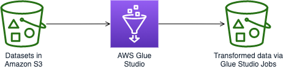

### Setting up Glue Studio

In this section we will setup an AWS Glue Studio job which is a pipeline of data preparation steps. During this process we will create the following:

* **Nodes:** these present steps in a job.
* **Job:** a logical pipeline of nodes connected.

Creating a Glue Studio job

1. On the [console](https://console.aws.amazon.com/gluestudio/), choose **Create and manage jobs**.

1. In **Create job** section, leave default value and click **Create**.
   
   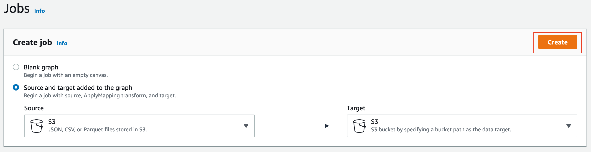
   
1. You will be presented with the Job editor, now we'll edit source node to select the tsv data set
   1. Click on the **Data source - S3 bucket node** bucket icon
   
   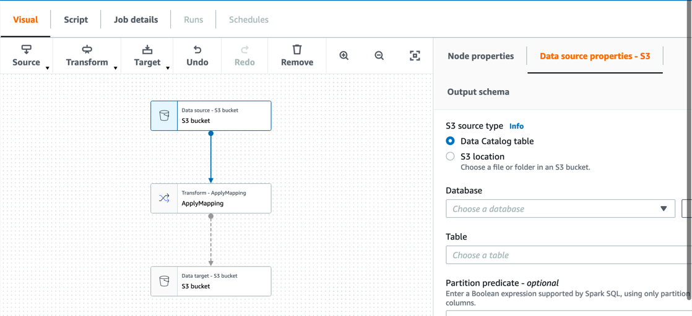
      
   1. Select the **Data source properties - S3 tab**
      
   1. For **S3 source type** select the radio **S3 location**
      
   1. For **S3 URL** enter **s3://amazon-reviews-pds/tsv/**
      
   1. For **Data format** select **CSV**
      
   1. For **Delimiter** select **Tab**
   
   Now go to **Output schema** tab and click **Infer schema** button. 
   As you may have noticed, without crawling the data, the data quality issues stick out.
   
   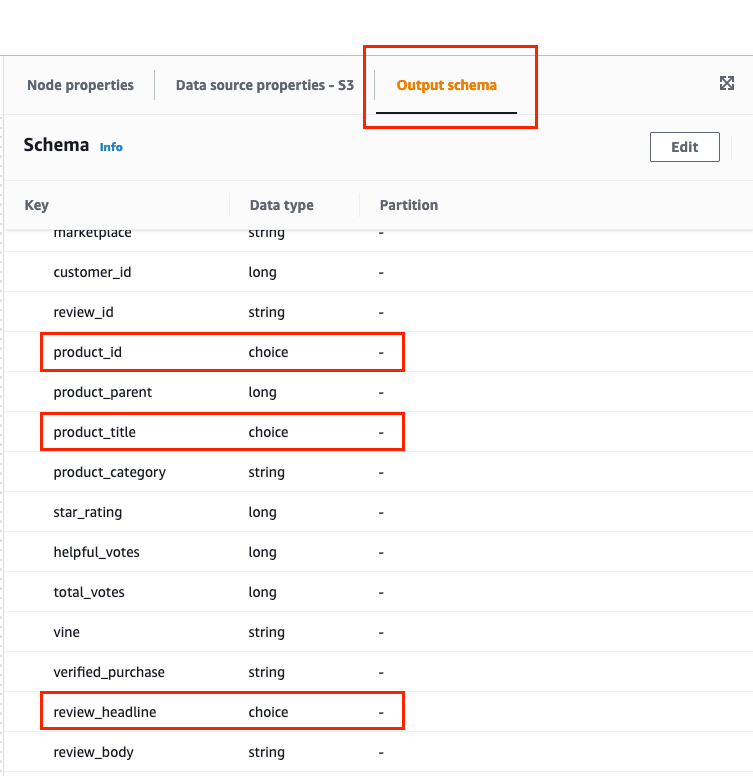
   
   A good thing though is that we can apply custom mappings

1. We'll need to delete the default **Apply Mapping** node as we'll add our own custom mapping.
   
1. To add custom mapping, Select **Transform** then **Custom Transform**
   
   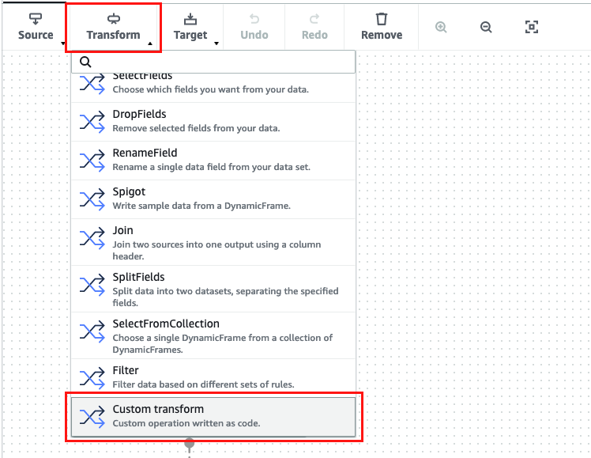
   
   1. In **Node properties** select **S3 - DataSource** as your Node Parent
      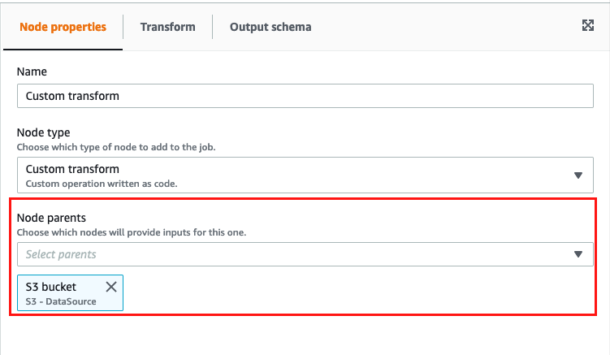
      
   1. In **Transform** tab enter the following code
      ```python
      def MyTransform (glueContext, dfc) -> DynamicFrameCollection:
       df = dfc.select(list(dfc.keys())[0]).toDF()
       gdf = DynamicFrame.fromDF(df, glueContext, "CustomTransform0")
       dyf_mapped = gdf.resolveChoice(specs = [('product_id','cast:string'),
                       ('product_title', 'cast:string'),
                       ('review_headline', 'cast:string'),
                       ('review_date', 'cast:date'),
                       ('star_rating', 'cast:int')])
       return(DynamicFrameCollection({"CustomTransform1": dyf_mapped}, glueContext))
      ```
      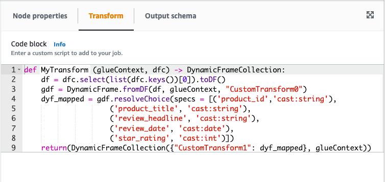
   1. When you use a custom transform node, 
      AWS Glue Studio cannot automatically infer the output schemas created by the transform. 
      You use the schema editor to describe the schema changes implemented by the custom transform code.
      
      Click **Output schema** tab and then click the **Edit** button. 
      Now we'll be reflecting the resolve choice casting and edit the type of some fields' types.
      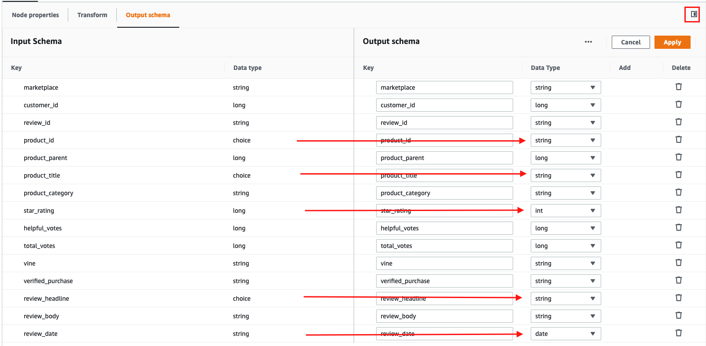
      
1. The custom mapping node returns a `DynamicFrameCollection` object to allow flexibility. 
   We'll need to link it to a **Select From Collection** node.
   
   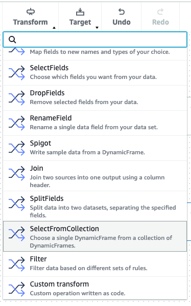
   
   Note, you'll need to set the parent node as the **Custom Transform** node.
   
1. Finally, we'll be editing the target node to select our bucket, partition the data, and catalog the result
   
   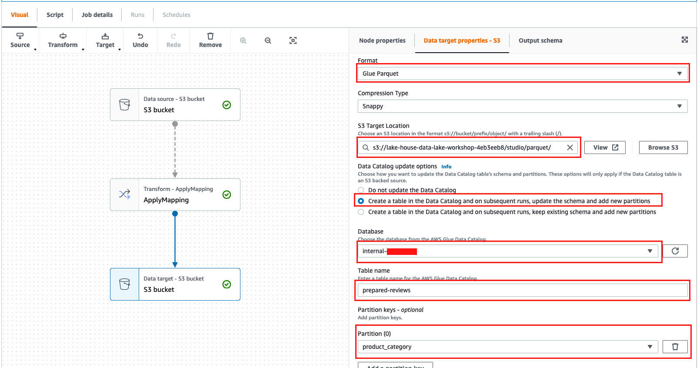
   
   1. In **Node Properties** make sure that Node parent is the **SelectFromCollection** node
      
   1. Then switch to **Data target properties - S3**
      
   1. In **Format** select **Glue Parquet**
       
   1. In **S3 Target Location** select as `s3://lake-house-data-lake-workshop-{random-id}/parquet/`. 
      Note if you will be doing both this lab and the AWS Glue DataBrew lab make sure to choose a different path for
      the output.
      
   1. Glue Studio jobs can update your Glue Data Catalog automatically with the schema definition 
      and new partitions. To enable this select 
      **Create a table in the Data Catalog and on subsequent runs, update the schema and add new partitions**
      
   1. The above option will open an option for you to select the Glue Catalog database. Select the custom database
   created as part of this workshop preparation stack that starts with prefix **internal-**
      
   1. For **Table** name enter **prepared-reviews**.
      
   1. For **Partition keys - optional** click **Add a partition key**, select `product_category` as partition key, and click **Add**
   
1. Select **Job details** tab
   
   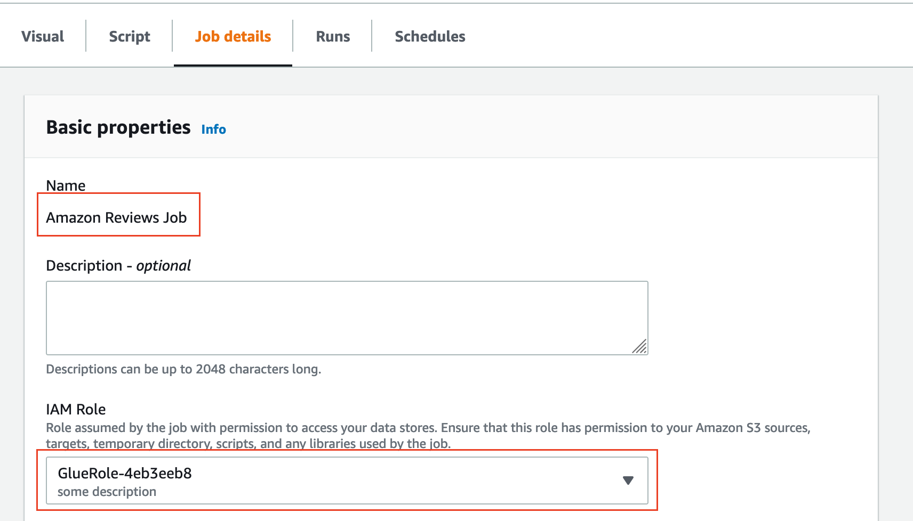
   
   1. Edit **Name** as `Amazon Reviews Job`.
      
   1. For IAM Role select the role created for the workshop `GlueRole-{randomID}`.
      
   1. Leave rest as default
   
1. Save job by clicking **Save** once the job is saved, click **Run**
   
   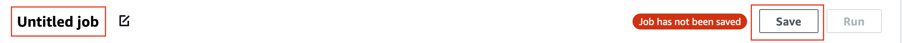

Your Job should look like this in the end

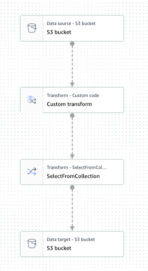

### Job status

You can always check the job status from the [AWS console](https://console.aws.amazon.com/gluestudio/home?region=us-east-1#/monitoring).

After job finishes you can Navigate to S3 console to the output location and verify that new files were created there.
You don't need this to continue to the next lab though as we'll use the pre-prepared data.

### Next Step
Continue to [Loading data in your Redshift cluster](../README.md#now-lets-load-data-in-your-cluster).