## 3. Lake House Lab

### Use Cases
#### Background

**Red Imports LLC (RIL)** is a mid-sized privately owned, retailer that specializes in home delivery of the finest luxury imported goods, particularly furniture, table-top items, decorative accessories and seasonal décor. In addition, RIL stocks a wide array of the most popular imported non-perishable food items from around the world. RIL aspires to help customers replicate the sights, sounds, smells, and tastes of exotic lands across the globe with just a click. The RIL slogan is: “Bringing the world to your door”

### Problems to solve

As part of their ongoing quest for efficiency and agility, RIL has recently retired their on-premise data center and has moved their entire IT environment to AWS. As part of the move to AWS, RIL migrated their data warehouse from Oracle to Redshift. Currently, RIL is in the process of building out their new data lake to further support expansion of their data collection for new AI/ML initiatives.

Red Imports LLC (RIL) is currently expanding their use of data science and AI/ML technologies to help them solve difficult optimization problems.
Architecture

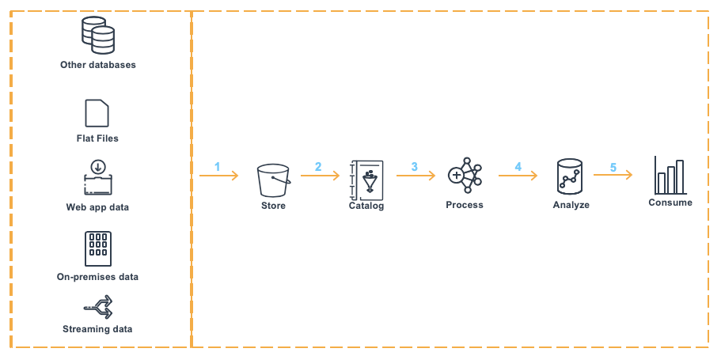

### Team

* Marie: She is a Data Engineer.
* Miguel: He is a Data Analyst.
### Working with the Data Lake
#### Before you Begin

Capture the following parameters from the launched CloudFormation template as you will use them in the lab.

* RedshiftClusterRoleArn
* GlueExternalDatabaseName
* TaskDataBucketName


#### Challenge

Miguel has recently been tasked with solving a few different business problems with data related to their website traffic and purchasing behavior. He noticed the history product review data is available in the Glue Data Catalog. He asked Marie how he could access this dataset that are stored in the S3 data lake. To solve this challenge Marie will do the following:
Take a glance at the dataset

First, let’s take a look at the raw data in S3. You’ll notice that the data is partitioned by product.

Navigate to: [https://s3.console.aws.amazon.com/s3/buckets/amazon-reviews-pds/parquet/?region=us-east-1](https://s3.console.aws.amazon.com/s3/buckets/amazon-reviews-pds/parquet/?region=us-east-1)

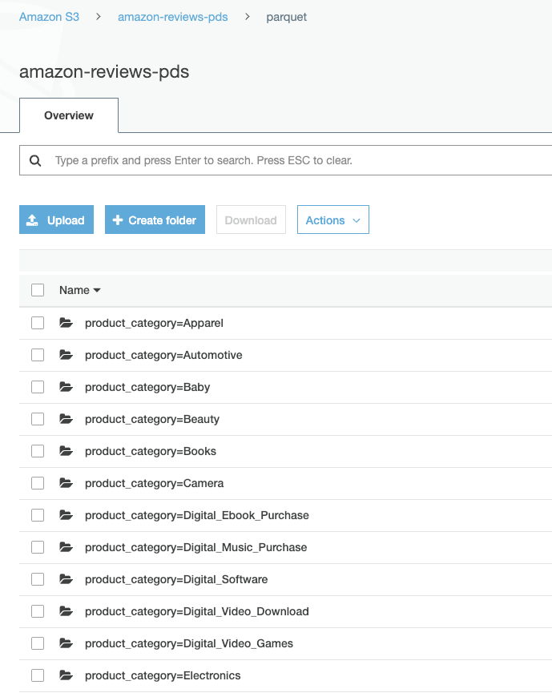

Next, let’s dive deeper and look at the Apparel category and see the files

Navigate to `product_category=Apparel` subfolder by clicking on the *product_category=Apparel* folder, data is stored in parquet columnar format.

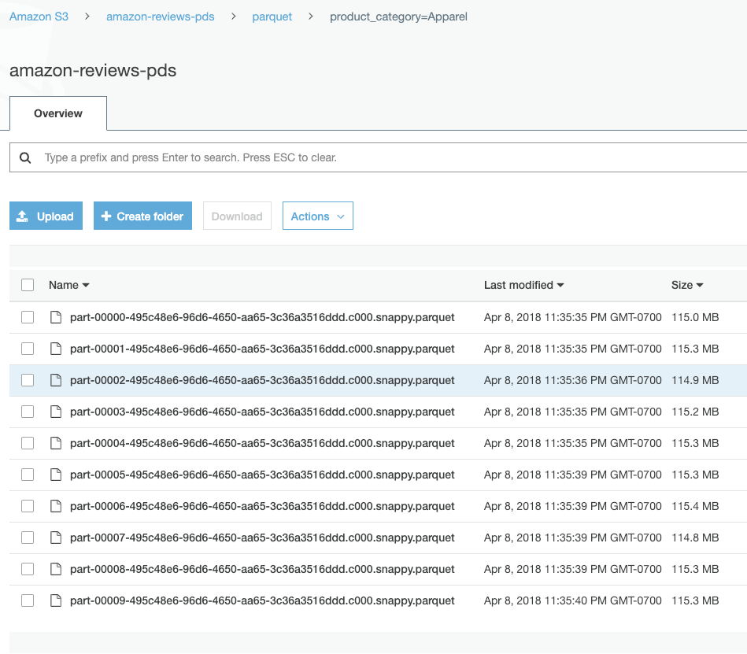

This dataset is not yet cataloged using the Glue Data Crawler. 

A crawler accesses your data store, extracts metadata, and creates table definitions in the AWS Glue Data Catalog.
For Schema on read data sets, the crawler fetches the first records (thousand) and figures out the schema based on the data format.

To crawl this external dataset go to Glue console: [https://console.aws.amazon.com/glue/home?region=us-east-1#catalog:tab=crawlers](https://console.aws.amazon.com/glue/home?region=us-east-1#catalog:tab=crawlers)

Select the crawler that starts with `GlueCrawlerExternalPrep` prefix, and click **Run crawler**.

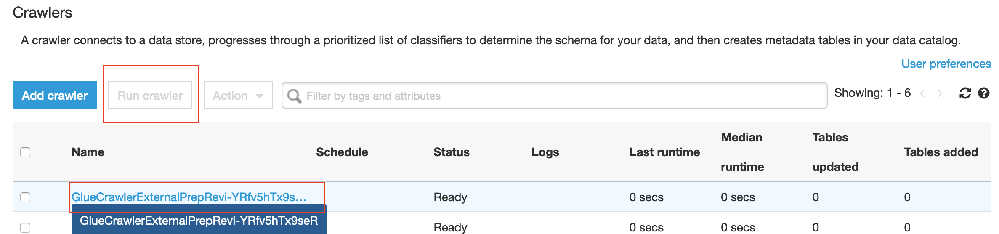

The crawler should take few minutes, once status changes to stopping we can go check the result. Let’s take a look at the Glue Catalog and check schema of this table.

Navigate to the glue table list: [https://console.aws.amazon.com/glue/home?region=us-east-1#catalog:tab=tables](https://console.aws.amazon.com/glue/home?region=us-east-1#catalog:tab=tables). 

Click on the table associated to `external-{randomId}` database

Inspecting the table metadata, we see some interesting things. For example: the SerDe of Parquet and the recordCount of **160 Million**.

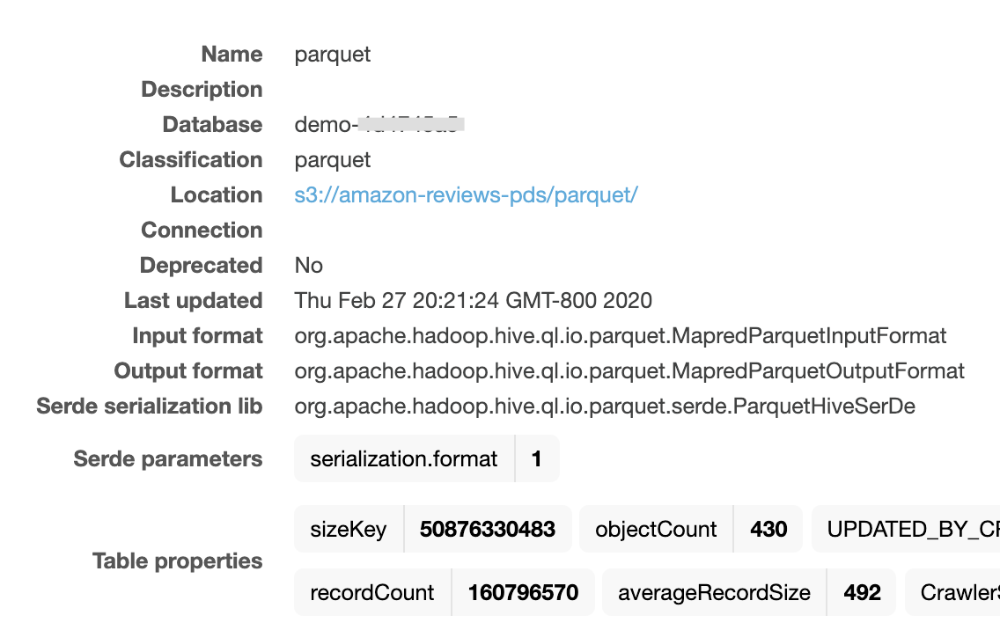

Note that Glue crawler is able to detect all columns including the partition column “Product_category”.

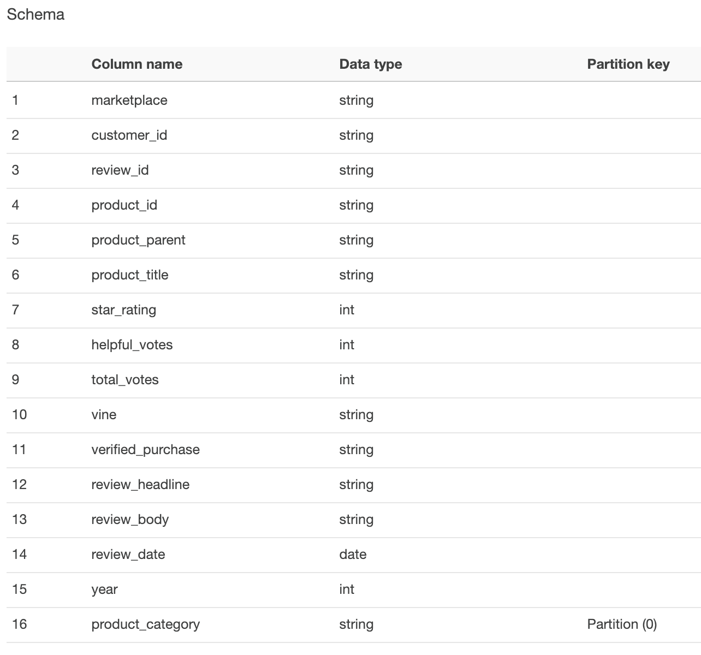

### Connect the data to Redshift

Marie told Miguel he could access this dataset directly using Redshift Spectrum, no need to load the data into Redshfit attached storage. 
She already setup a role to allow Redshift access Glue data catalog and S3 buckets. 
All he need is to connect the Redshift Cluster to this External Database by creating an external schema to point to it.

**Note:** Replace the value for <GlueExternalDatabaseName> with `external-{randomId}` and <RedshiftClusterRoleArn> with the value previously noted.

Execute the following command to setup external schema to allow Redshift access the dataset:

```sql
DROP SCHEMA IF EXISTS demo;
CREATE EXTERNAL SCHEMA IF NOT EXISTS demo
FROM DATA CATALOG DATABASE '<GlueExternalDatabaseName>'
IAM_ROLE '<RedshiftClusterRoleArn>';
```

Let’s do a quick check to confirm we can access the data. Note, the 160+ million records matches the number the Glue Crawler showed.

Execute the following:

```sql
select count(1) from demo.parquet;
```

Please note that no data was moved, or loaded in the cluster. 
You're currently experiencing the power **Redshift Spectrum** and **AQUA** querying the parquet data in place.

### Analyze the Data

Looks interesting! Now Miguel wants to aggregate the reviews data by product and compute their average rating. 
In order to use this data in future queries easily, he will create a view named `product_reviews_agg` on this external dataset.

Execute the following:

```sql
create view public.product_reviews_agg AS
select
  marketplace, product_category, product_parent, product_title, year,
  COUNT(1) as review_rating_total,
  AVG(star_rating) as review_rating_avg,
  (COUNT(CASE WHEN verified_purchase='Y' THEN 1 ELSE 0 END)/COUNT(1))*100 as verified_pct
FROM  demo.parquet
GROUP BY 1,2,3,4,5
with no schema binding;
```

Now, Let’s find the most reviewed products in the Home and Grocery categories using the view we just created.

Execute the following:

```sql
select
  marketplace, product_category, product_parent, product_title, year,
  review_rating_total, review_rating_avg, verified_pct
FROM public.product_reviews_agg
WHERE product_category in ('Home' , 'Grocery')
and marketplace = 'US'
and review_rating_total >4000
and verified_pct >99
order BY product_category, product_parent, product_title, year;
```

Look for which product is the most interesting to you. Let’s take “San Francisco Bay One Cup Coffee” which is the most reviewed product. Look at it further to try and understand how this product is perceived over time by the customers that actually purchased it. Rolling averages are great metrics to look for trends…

Execute the following:

```sql
select
  A.marketplace, A.product_category, A.product_parent,
  A.product_title, A.review_date,
  date_part(epoch, A.review_date) as ts_review,
  COUNT(1) over (order by A.review_date rows 10 preceding) as total,
  AVG(CAST(A.star_rating as decimal(3,2))) over (order by A.review_date, A.star_rating rows 30 preceding) as avg30,
  AVG(CAST(A.star_rating as decimal(3,2))) over (order by A.review_date, A.star_rating rows 90 preceding) as avg90
  FROM demo.parquet A
  WHERE A.product_parent = 267956568
  ORDER BY A.review_date
  limit 1000;
```

#### Optional exercise

**Note:** this lab depends on the ETL streaming pipeline lab. Do this only if you finished the streaming one. 
Or, otherwise execute the following statement. Just note you'll not be seeing recent streaming results.

```sql
CREATE TABLE public.product_reviews(
  marketplace varchar(2),
  customer_id varchar(32),
  review_id varchar(24),
  product_id varchar(24),
  product_parent varchar(32),
  product_title varchar(512),
  star_rating int,
  helpful_votes int,
  total_votes int,
  vine char(1),
  verified_purchase char(1),
  review_headline varchar(256),
  review_body varchar(max),
  review_date date,
  year int,
  product_category varchar(32),
  insert_ts datetime default current_timestamp)
DISTSTYLE KEY
DISTKEY (customer_id)
SORTKEY (
    marketplace,
    product_category,
    review_date);
```

In previous lab, we already have the streaming product review dataset setup in the datalake. 
Marie can create a consistent view for Miguel to see both the latest data which is loaded into Redshift and the history data which is in S3. She will need to create a union all view around the two data sets.

Execute the following command, Note the use of `no schema binding` as the data in S3 will leverage a `schema on read` strategy.

```sql
create or replace view public.product_reviews_complete as
select *
from public.product_reviews
union all
select *, '1/1/1900'::datetime as insert_ts
from demo.parquet
with no schema binding;
```

Finally, Marie will test the consolidated view to ensure that both the hot and cold data is accessible.

Execute the following query. Note the most recent data along with the older data from the data lake is available for querying.

```sql
select
  date_trunc('year', insert_ts),
  count(1)
from public.product_reviews_complete
where product_category = 'Apparel'
group by 1
order by 1 desc
limit 20
```

### Extend the Data Warehouse with the Data Lake

#### Before you begin

We'll need to load external dimension tables.

Capture the following parameters from [the launched CloudFormation template](https://console.aws.amazon.com/cloudformation/home?region=us-east-1#/stacks?filteringText=&filteringStatus=active&viewNested=true&hideStacks=false) as you will use them in the lab.

* Lab3LoadDataIntoCluster
* RedshiftClusterPassword
* TaskDataBucketName

Go to your Cloud9 environment, and open a new terminal, execute the following command.
```shell
cd ~/environment/amazon-redshift-lakehouse-workshop/lab3-lake-house/
aws s3 cp s3://salamander-us-east-1/reinvent2018/ant353/etlscript/tpsds.sql .
```

**Important:** Then execute the command contents of `Lab3LoadDataIntoCluster` and enter your cluster password `RedshiftClusterPassword`.

#### Extend the Data Warehouse with the Data Lake

After looking at the review trends for the SF Bay One Cupn Coffee product, Miguel, wants to gain further insight into the customers across all the product categories. He also wants to leverage the existing customer demographic information in Redshift to augment the data. To support his reporting audience, Miguel will place the combined data set into a new Redshift table.

Execute the following which will combine the loaded customer demographic data with the external reviews data into a new table:

```sql
create table public.customer_trends as
select
  A.product_category,A.product_parent,
  A.review_date as Review_Date,
  C.ca_state as Customer_State,
  AVG(CAST(A.star_rating as decimal(3,2)))
    over (partition by product_parent
          order by A.review_date, A.star_rating rows 30 preceding)
    as review_rating_30rolling_avg,
  AVG(CAST(A.star_rating as decimal(3,2)))
    over (partition by product_parent
          order by A.review_date, A.star_rating rows 90 preceding)
    as review_rating_90rolling_avg
from
  demo.parquet  A,
  public.customer B,
  public.customer_address C
where A.customer_id = B.c_customer_sk
  and B.c_current_addr_sk = C.ca_address_sk
  and marketplace = 'US'
  and A.review_date > '2015-01-01'
  order by A.product_parent, A.review_date;
```

The result is very useful! Miguel wants to export the result back to Data lake to share it with other teams. 
He can easily unload data from Redshift to the datalake, so other tools can process the data when needed. Note: UNLOAD supports dynamic partitioning and parquet format. 
By selecting a partition column we can optimize the output for query performance.

**Note:** Replace the value for <TaskDataBucketName> and <RedshiftClusterRoleArn> with the value previously determined.

Execute the following which will export the combined table to a new S3 location:

```sql
unload ('select * from public.customer_trends')
to 's3://<TaskDataBucketName>/rll-datalake/report/'
iam_role '<RedshiftClusterRoleArn>'
FORMAT PARQUET
ALLOWOVERWRITE
PARTITION BY (product_category );
```

You can also use CTAS.

```sql
CREATE EXTERNAL TABLE
demo.customer_trends
PARTITIONED BY (product_category)
STORED AS PARQUET
LOCATION 's3://<TaskDataBucketName>/rll-datalake/customer_trends/'
AS select * from public.customer_trends;
```

Let’s check the exported data on S3

**Note:** Replace the value for <TaskDataBucketName> with the value previously determined.

Navigate to the S3: https://s3.console.aws.amazon.com/s3/buckets/<TaskDataBucketName>/rll-datalake/report/

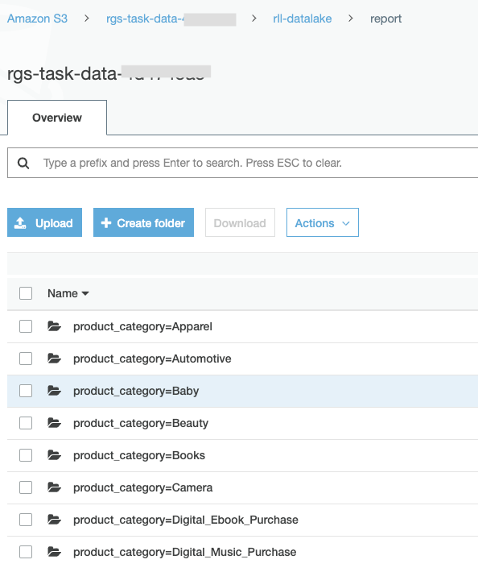

### Share data with other Analytics services

#### Access the report with other Analytics services

Let’s add this exported report dataset to our datalake catalog to allow other Analytic services access it easily.

First, we use [AWS Glue](https://console.aws.amazon.com/glue/home?region=us-east-1) to create a crawler to infer the report schema. 
Provide a name for the crawler, e.g. product_review_report

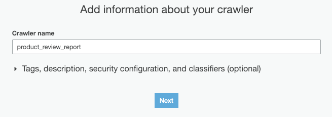

Select Data Stores as source type and click Next

Choose S3 as data store and select where the report data located.

**Note:** Replace the value for <TaskDataBucketName> with the value previously determined.

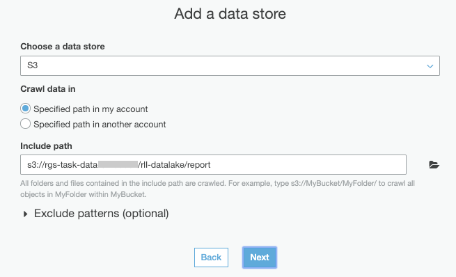

We are almost done. Click “No” for Add another data store and click Next

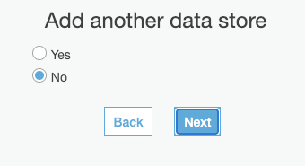

Select a role that can access the S3 report data. Use the role that is pre-created by CFN named `GlueRole-{randomId}`

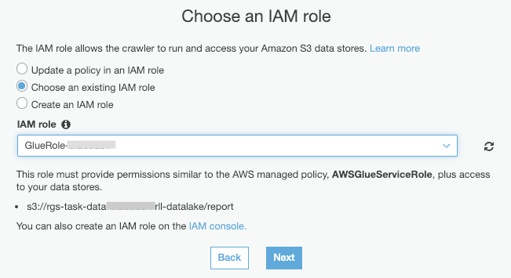

You can schedule the crawler to run repeatedly to discover if new data is added automatically. But for this workshop you can select **on-demand**.

Select the `internal-{randomId}` as the target database

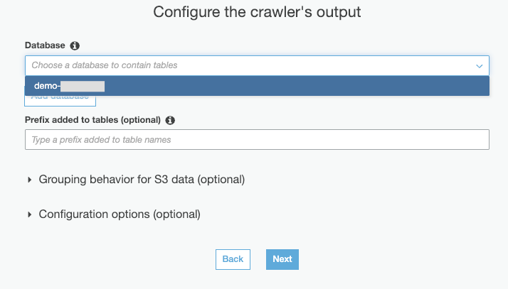

Review crawler information, if everything is correct, click “Finish”

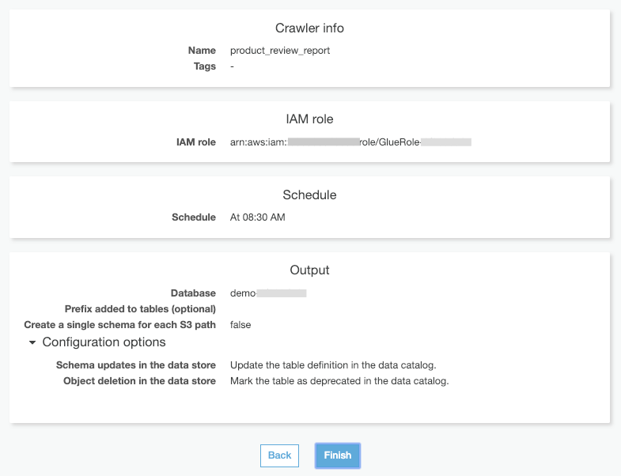

Run clawler, it will take 1-2 minutes. 
Once it’s stopped, Navigate to the glue table list: 
[https://console.aws.amazon.com/glue/home?region=us-east-1#catalog:tab=tables](https://console.aws.amazon.com/glue/home?region=us-east-1#catalog:tab=tables) and exam the table it creates.

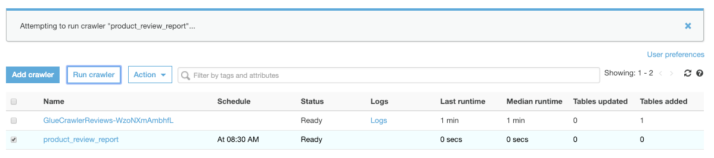

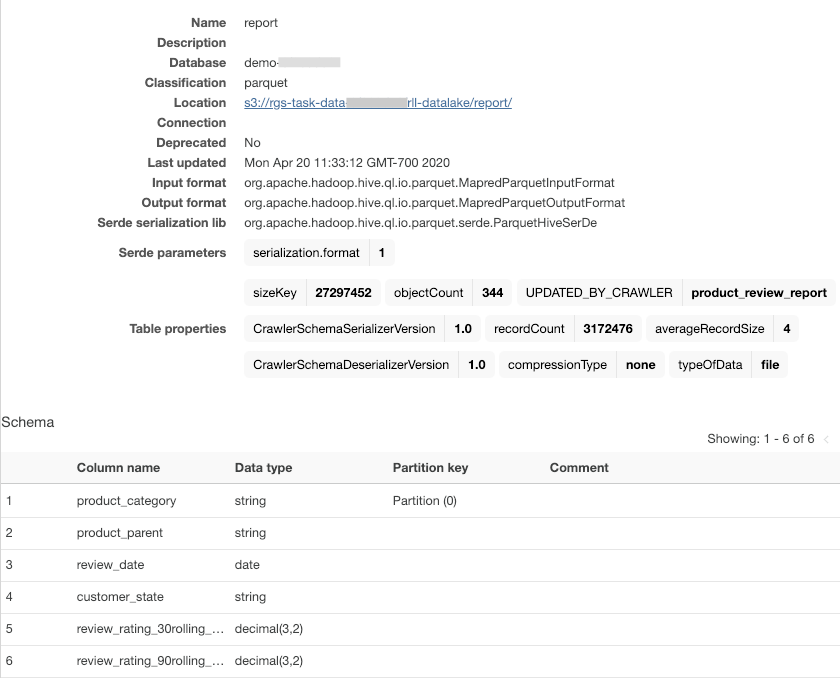

Now the table is in our central data catalog, we could access it from other Analytic services. Let’s go to [Athena](https://console.aws.amazon.com/athena/home?region=us-east-1#)

Before you run your first query in Athena, you need to set up a query result location in Amazon S3.

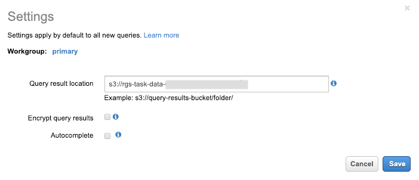

Then you can query the product_review_report table.

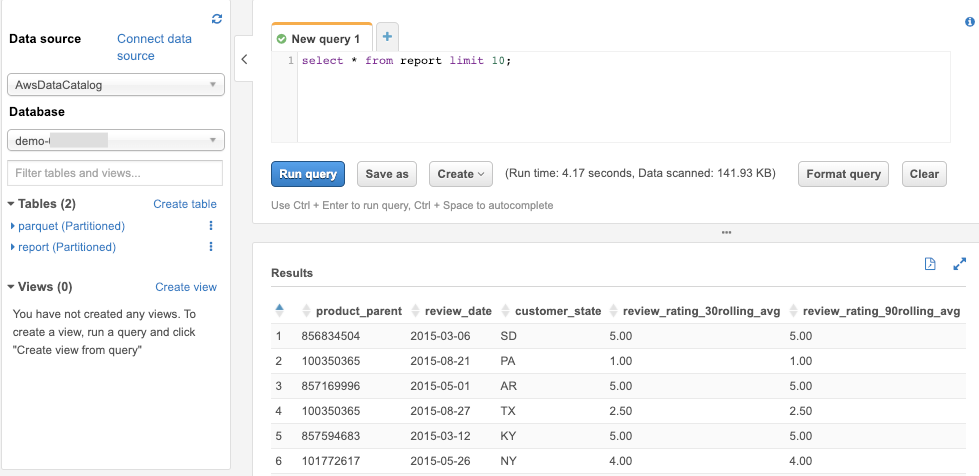

### Next Step
Continue to [Visualizing your data](../lab4-data-visualization/README.md).