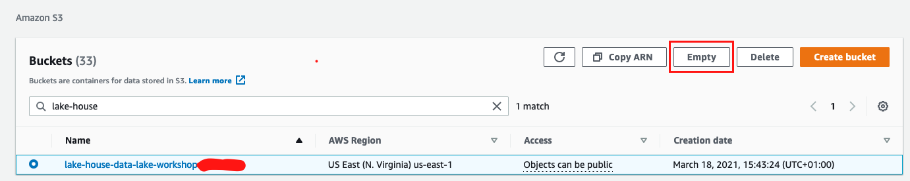
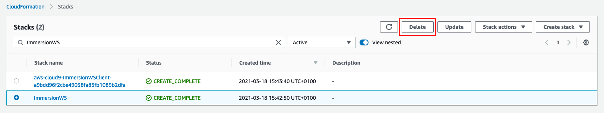

## Wrap up and cleaning existing resources

### Before you Begin

Capture the following parameters from the launched CloudFormation template as you will use them in the lab.

* TaskDataBucketName

Now you can terminate the resources created by this lab to avoid any additional charges.

1. Empty your S3 task bucket to be able to delete your stack.
   
   Through CLI
   
    ```shell
    aws s3 rm s3://<TaskDataBucketName> --recursive
    ```
   
   Or Alternatively from the [AWS Console](https://s3.console.aws.amazon.com/s3/home?region=us-east-1)
    
    
   
1. When going to CloudFormation, you'll find 2 stacks. 
   One you created and one that was automatically created for your Cloud9 environment. 
   You only need to delete the one that you created from the 
   [AWS Console](https://console.aws.amazon.com/cloudformation/home?region=us-east-1#/stacks?filteringStatus=active&filteringText=&viewNested=true&hideStacks=false).
   

### Next Step
Continue to [Additional resources](../lab7-additional-resource/README.md).